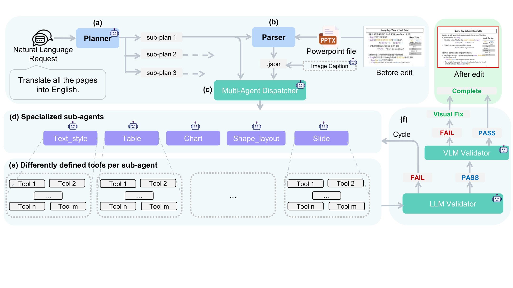
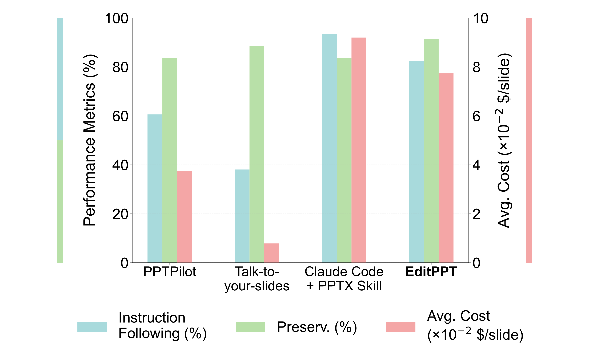
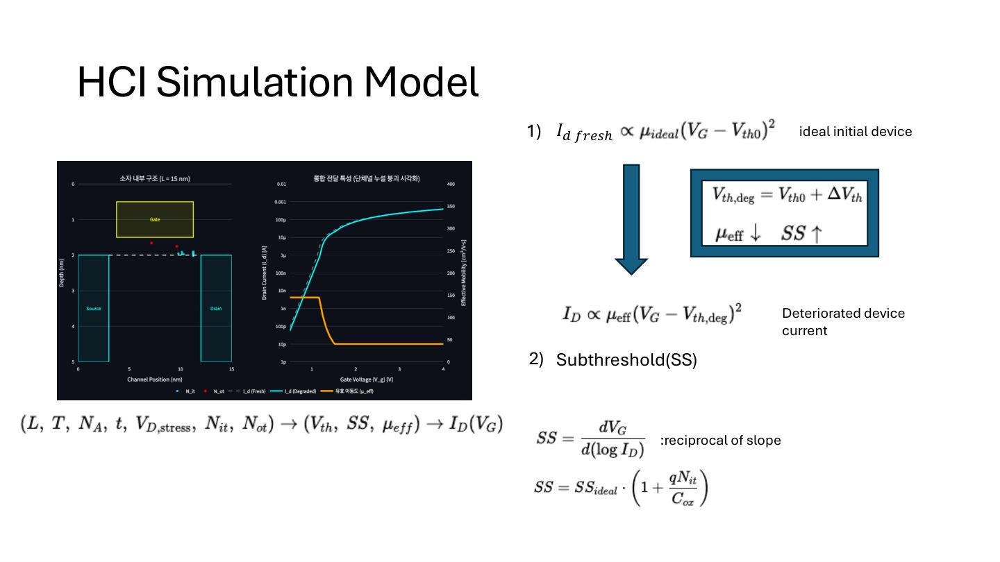
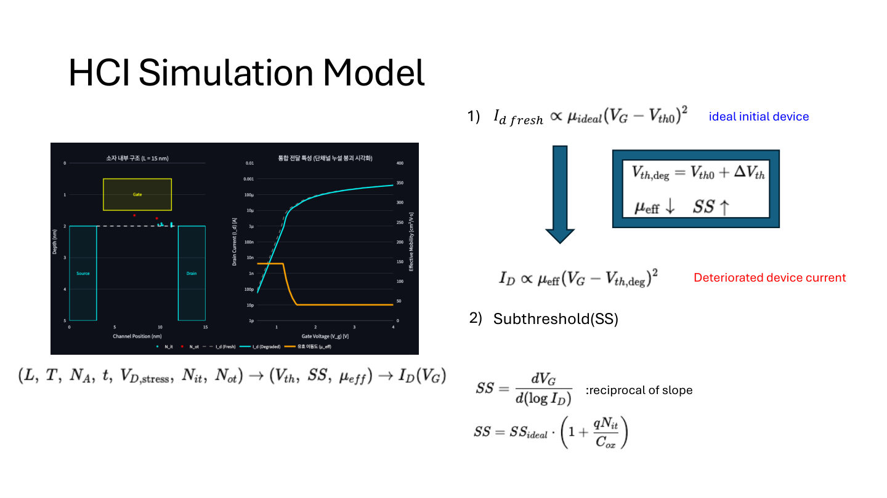
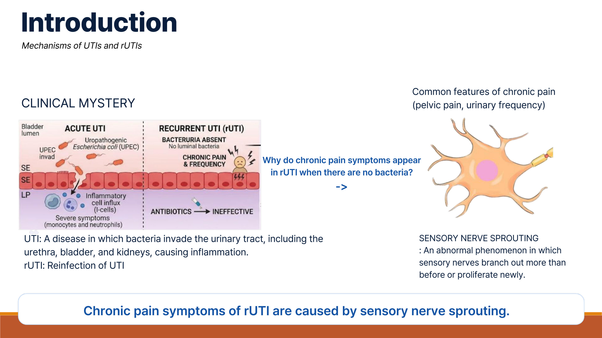
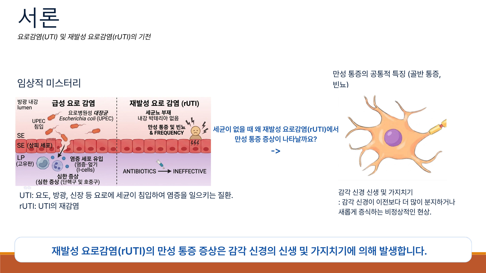
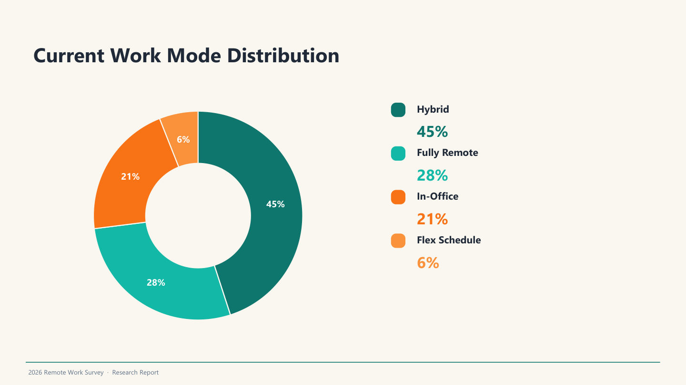
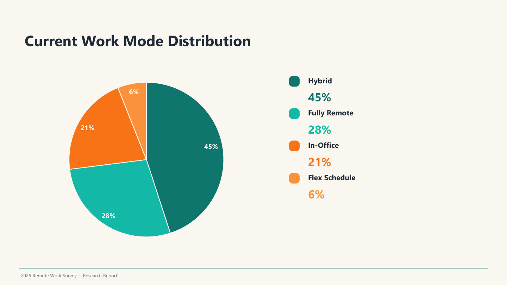

# EditPPT

**An AI-powered PowerPoint editing agent.**

<p align="center">
  
</p>

Give it a natural-language instruction — *"Change all titles to red"*, *"Summarize slide 3 into three bullets"* — and EditPPT plans the edits, runs them on your `.pptx` via PowerPoint COM automation, and validates the result before saving.

📊 **[Benchmark Dataset](https://huggingface.co/datasets/EditPPT/DECKEDIT-BENCH)**


## Results

<p align="center">
  
</p>

Evaluated against PPTPilot, Talk-to-your-slides, and Claude Code + PPTX Skill on **instruction following**, **content preservation**, and **average cost per slide**. Our method delivers the **strongest content preservation** of the four — it applies the requested edit without disturbing the rest of the deck — while staying competitive on instruction following at a moderate per-slide cost.


## Benchmark

EditPPT is evaluated on **DECKEDIT-Bench**, a benchmark of **183 natural-language editing prompts across 28 real-world decks**, spanning three length strata (Short ≤10 slides · Medium 11–30 · Long >30) and two languages (English and Korean). Each prompt is labelled along two axes — instruction style (**Explicit** / **Pattern**) × complexity (**Simple** / **Compound**) — and tagged with its edit actions (add / delete / replace / slide-level) and edit targets, so results can be broken down by capability.
Dataset: **[DECKEDIT-BENCH on Hugging Face](https://huggingface.co/datasets/EditPPT/DECKEDIT-BENCH)**.

**Example edits** — actual EditPPT runs (before → after):

<table>
  <tr>
    <th align="left">Instruction</th>
    <th align="center">Before</th>
    <th align="center">After</th>
  </tr>
  <tr>
    <td><b>Recolor the two device-state labels</b><br>(<span>blue</span> / <span>red</span>) <br><sub>Explicit · single slide</sub></td>
    <td></td>
    <td></td>
  </tr>
  <tr>
    <td><b>Translate the deck into Korean</b><br><sub>incl. text inside figures · every slide</sub></td>
    <td></td>
    <td></td>
  </tr>
  <tr>
    <td><b>Change the chart to a pie chart</b><br><sub>Explicit · single chart</sub></td>
    <td></td>
    <td></td>
  </tr>
</table>

## Requirements

- **Windows** + **Microsoft PowerPoint** (uses the COM API via `pywin32`)
- **Python 3.11+**
- **API key** for at least one LLM provider (OpenAI recommended)

## Installation

```cmd
git clone https://github.com/editppt1/EditPPT.git
cd EditPPT
poetry install
```

Set `OPENAI_API_KEY` (required). Optional: `GEMINI_API_KEY` for vision validation / image generation.

## Usage

```cmd
# Web UI (recommended)
python -m editppt.main_web --port 5000        # then open http://127.0.0.1:5000

# CLI
python -m editppt.main --file_path "deck.pptx" --prompt "Change all titles to red"
```

## Configuration

Models are set in `editppt/config.py` (`gpt-4.1` for planning/editing, `gemini-2.5-pro` for optional vision QA).

## Citation

```bibtex
@misc{editppt,
  title  = {EditPPT: An AI-powered PowerPoint Editing Agent},
  author = {Anonymous},
  year   = {2026}
}
```
