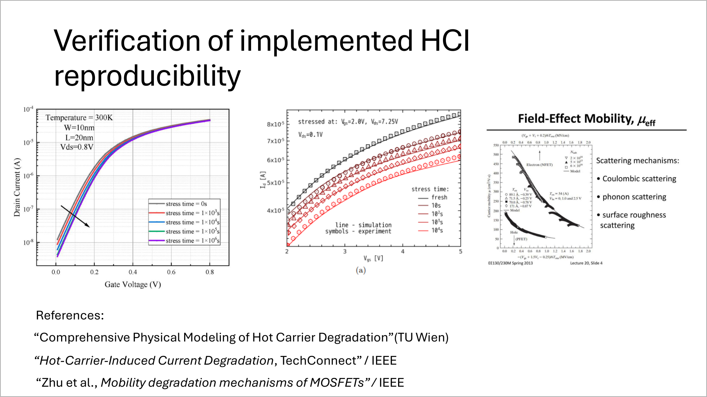
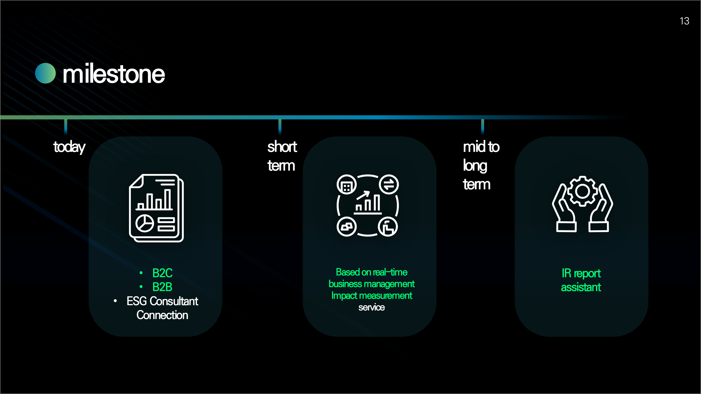
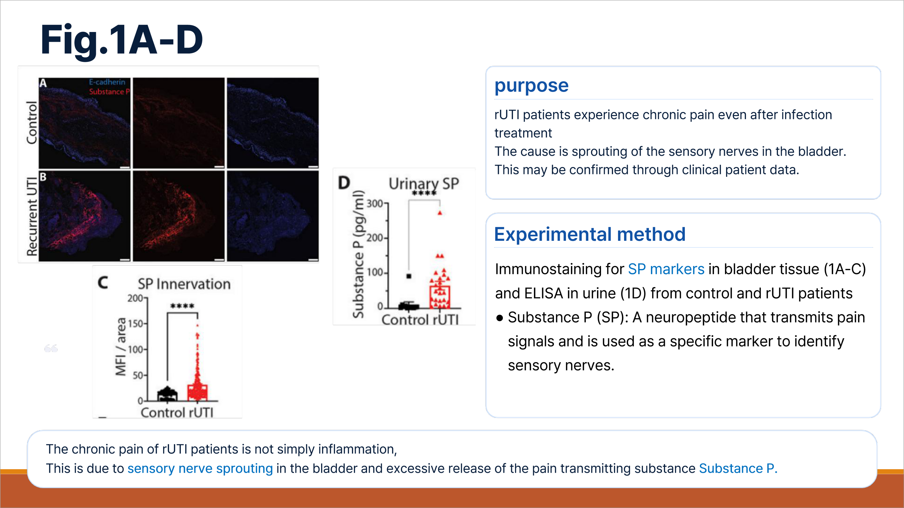

# EditPPT

**An AI-powered PowerPoint editing agent.**

<p align="center">
  
</p>

Give it a natural-language instruction — *"Change all titles to red"*, *"Summarize slide 3 into three bullets"* — and EditPPT plans the edits, runs them on your `.pptx` via PowerPoint COM automation, and validates the result before saving.

📊 **[Benchmark Dataset](https://example.com/editppt-benchmark)** &nbsp;·&nbsp; ▶️ **[Live Demo](https://example.com/editppt-demo)** &nbsp;·&nbsp; Project page: *(tbd)*


## Results

<p align="center">
  
</p>

Evaluated against PPTPilot, Talk-to-your-slides, and Claude Code + PPTX Skill on **instruction following**, **content preservation**, and **average cost per slide**.


## Benchmark

EditPPT is evaluated on a benchmark of natural-language PowerPoint editing tasks spanning two axes — instruction style (**Explicit** / **Pattern**) × complexity (**Simple** / **Compound**) — across short, medium, and long decks.
Dataset and evaluation scripts: **[link](tbd)** .

<table>
  <tr>
    <td width="33%"></td>
    <td width="33%"></td>
    <td width="33%"></td>
  </tr>
  <tr align="center">
    <td>Explicit · Simple <sub>(Medium)</sub></td>
    <td>Explicit · Compound <sub>(Medium)</sub></td>
    <td>Pattern · Simple <sub>(Long)</sub></td>
  </tr>
</table>

## Demo

Watch EditPPT edit a deck end-to-end: **[demo](https://example.com/editppt-demo)** *(dummy — to be replaced)*.

## Requirements

- **Windows** + **Microsoft PowerPoint** (uses the COM API via `pywin32`)
- **Python 3.11+**
- **API key** for at least one LLM provider (OpenAI recommended)

## Installation

```cmd
git clone <repository-url>   # TBD
cd EditPPT
poetry install               # or: pip install -r requirements.txt
```

Set `OPENAI_API_KEY` (required). Optional: `GEMINI_API_KEY` for vision validation / image generation.

## Usage

```cmd
# Web UI (recommended)
python -m editppt.main_web --port 5000        # then open http://127.0.0.1:5000

# CLI
python -m editppt.main --file_path "deck.pptx" --prompt "Change all titles to red"
```

## Configuration

Models are set in `editppt/config.py` (`gpt-4.1` for planning/editing, `gemini-2.5-pro` for optional vision QA).

## Citation

```bibtex
@misc{editppt,
  title  = {EditPPT: An AI-powered PowerPoint Editing Agent},
  author = {Anonymous},
  year   = {2026}
}
```
