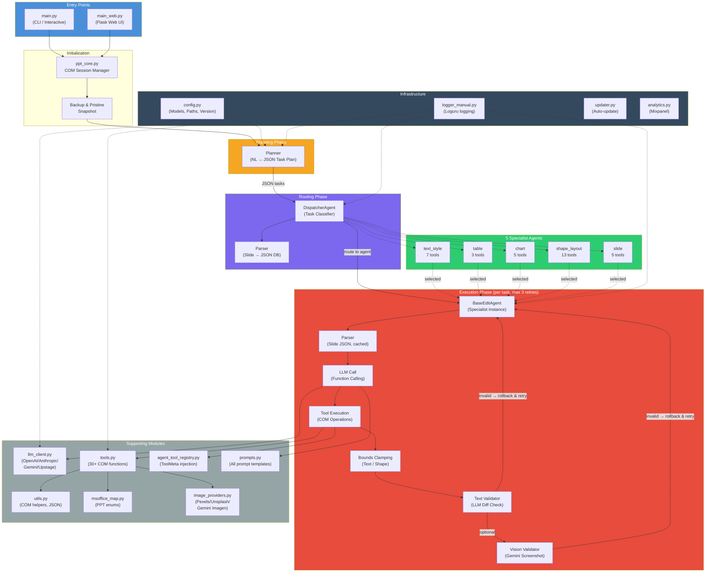
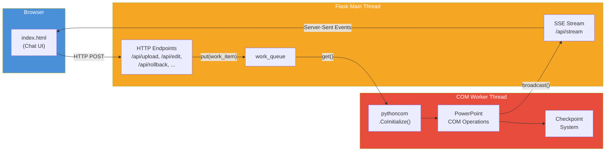
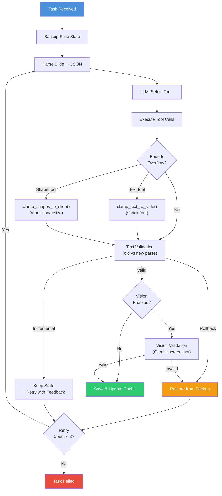
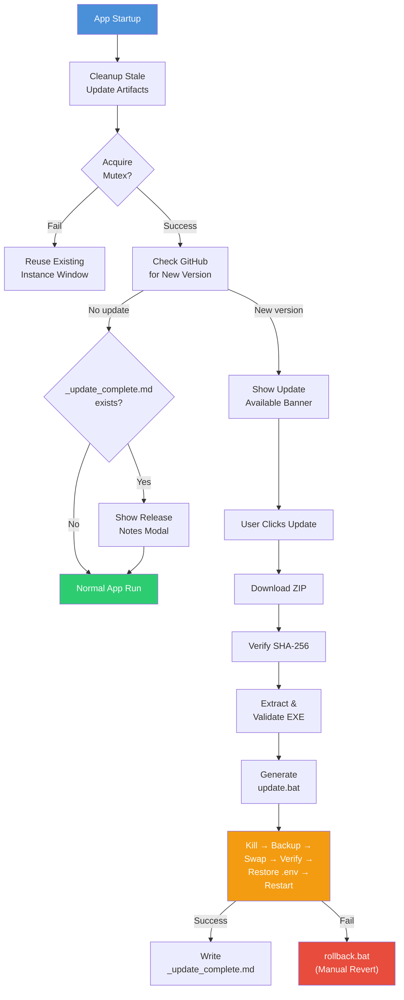

# EditPPT System Architecture

## Overall Pipeline

```mermaid
flowchart TB
    subgraph Entry["Entry Points"]
        CLI["main.py<br/>(CLI / Interactive)"]
        WEB["main_web.py<br/>(Flask Web UI)"]
    end

    subgraph Init["Initialization"]
        PPT_CORE["ppt_core.py<br/>COM Session Manager"]
        BACKUP["Backup & Pristine<br/>Snapshot"]
    end

    subgraph Planning["Planning Phase"]
        PLANNER["Planner<br/>(NL → JSON Task Plan)"]
    end

    subgraph Routing["Routing Phase"]
        DISPATCHER["DispatcherAgent<br/>(Task Classifier)"]
        PARSER_R["Parser<br/>(Slide → JSON DB)"]
    end

    subgraph Execution["Execution Phase (per task, max 3 retries)"]
        direction TB
        AGENT["BaseEditAgent<br/>(Specialist Instance)"]
        PARSER_E["Parser<br/>(Slide JSON, cached)"]
        LLM_CALL["LLM Call<br/>(Function Calling)"]
        TOOL_EXEC["Tool Execution<br/>(COM Operations)"]
        CLAMP["Bounds Clamping<br/>(Text / Shape)"]
        TEXT_VALID["Text Validator<br/>(LLM Diff Check)"]
        VISION_VALID["Vision Validator<br/>(Gemini Screenshot)"]
    end

    subgraph Agents["5 Specialist Agents"]
        A1["text_style<br/>7 tools"]
        A2["table<br/>3 tools"]
        A3["chart<br/>5 tools"]
        A4["shape_layout<br/>13 tools"]
        A5["slide<br/>5 tools"]
    end

    subgraph Support["Supporting Modules"]
        LLM_CLIENT["llm_client.py<br/>(OpenAI/Anthropic/<br/>Gemini/Upstage)"]
        TOOLS["tools.py<br/>(30+ COM functions)"]
        TOOL_REG["agent_tool_registry.py<br/>(ToolMeta injection)"]
        PROMPTS["prompts.py<br/>(All prompt templates)"]
        UTILS["utils.py<br/>(COM helpers, JSON)"]
        MSOFFICE["msoffice_map.py<br/>(PPT enums)"]
        IMG_PROV["image_providers.py<br/>(Pexels/Unsplash/<br/>Gemini Imagen)"]
    end

    subgraph Infra["Infrastructure"]
        CONFIG["config.py<br/>(Models, Paths, Version)"]
        LOGGER["logger_manual.py<br/>(Loguru logging)"]
        UPDATER["updater.py<br/>(Auto-update)"]
        ANALYTICS["analytics.py<br/>(Mixpanel)"]
    end

    %% Main Flow
    CLI & WEB --> PPT_CORE
    PPT_CORE --> BACKUP
    BACKUP --> PLANNER
    PLANNER -->|"JSON tasks"| DISPATCHER
    DISPATCHER --> PARSER_R
    DISPATCHER -->|"route to agent"| AGENT

    %% Agent Selection
    DISPATCHER -.-> A1 & A2 & A3 & A4 & A5
    A1 & A2 & A3 & A4 & A5 -.->|"selected"| AGENT

    %% Execution Flow
    AGENT --> PARSER_E
    PARSER_E --> LLM_CALL
    LLM_CALL --> TOOL_EXEC
    TOOL_EXEC --> CLAMP
    CLAMP --> TEXT_VALID
    TEXT_VALID -->|"optional"| VISION_VALID
    VISION_VALID -->|"invalid → rollback & retry"| AGENT
    TEXT_VALID -->|"invalid → rollback & retry"| AGENT

    %% Support Dependencies
    LLM_CALL --> LLM_CLIENT
    LLM_CALL --> PROMPTS
    TOOL_EXEC --> TOOLS
    TOOL_EXEC --> TOOL_REG
    TOOLS --> UTILS
    TOOLS --> MSOFFICE
    TOOLS --> IMG_PROV

    %% Infrastructure
    CONFIG -.-> LLM_CLIENT & TOOLS & PLANNER
    LOGGER -.-> AGENT & PLANNER & DISPATCHER

    %% Styling
    style Entry fill:#4a90d9,color:#fff
    style Planning fill:#f5a623,color:#fff
    style Routing fill:#7b68ee,color:#fff
    style Execution fill:#e74c3c,color:#fff
    style Agents fill:#2ecc71,color:#fff
    style Support fill:#95a5a6,color:#fff
    style Infra fill:#34495e,color:#fff
```

## Web UI Threading Model

```mermaid
flowchart LR
    subgraph Browser["Browser"]
        UI["index.html<br/>(Chat UI)"]
    end

    subgraph FlaskThread["Flask Main Thread"]
        HTTP["HTTP Endpoints<br/>/api/upload, /api/edit,<br/>/api/rollback, ..."]
        SSE["SSE Stream<br/>/api/stream"]
        QUEUE["work_queue"]
    end

    subgraph COMThread["COM Worker Thread"]
        COM_INIT["pythoncom<br/>.CoInitialize()"]
        PPT_OPS["PowerPoint<br/>COM Operations"]
        CHECKPOINT["Checkpoint<br/>System"]
    end

    UI -->|"HTTP POST"| HTTP
    HTTP -->|"put(work_item)"| QUEUE
    QUEUE -->|"get()"| COM_INIT
    COM_INIT --> PPT_OPS
    PPT_OPS --> CHECKPOINT
    PPT_OPS -->|"broadcast()"| SSE
    SSE -->|"Server-Sent Events"| UI

    style Browser fill:#4a90d9,color:#fff
    style FlaskThread fill:#f5a623,color:#fff
    style COMThread fill:#e74c3c,color:#fff
```

## Retry & Rollback Flow

```mermaid
flowchart TD
    START["Task Received"] --> BACKUP_SLIDE["Backup Slide State"]
    BACKUP_SLIDE --> PARSE["Parse Slide → JSON"]
    PARSE --> LLM["LLM: Select Tools"]
    LLM --> EXEC["Execute Tool Calls"]
    EXEC --> CLAMP_CHECK{"Bounds<br/>Overflow?"}

    CLAMP_CHECK -->|"Text tool"| CLAMP_TEXT["clamp_text_to_slide()<br/>(shrink font)"]
    CLAMP_CHECK -->|"Shape tool"| CLAMP_SHAPE["clamp_shapes_to_slide()<br/>(reposition/resize)"]
    CLAMP_CHECK -->|"No"| VALIDATE

    CLAMP_TEXT --> VALIDATE
    CLAMP_SHAPE --> VALIDATE

    VALIDATE["Text Validation<br/>(old vs new parse)"]
    VALIDATE -->|"Valid"| VISION{"Vision<br/>Enabled?"}
    VALIDATE -->|"Incremental"| RETRY_INC["Keep State<br/>+ Retry with Feedback"]
    VALIDATE -->|"Rollback"| ROLLBACK["Restore from Backup"]

    VISION -->|"Yes"| VISION_CHECK["Vision Validation<br/>(Gemini screenshot)"]
    VISION -->|"No"| SUCCESS

    VISION_CHECK -->|"Valid"| SUCCESS["Save & Update Cache"]
    VISION_CHECK -->|"Invalid"| ROLLBACK

    ROLLBACK --> RETRY{"Retry<br/>Count < 3?"}
    RETRY_INC --> RETRY
    RETRY -->|"Yes"| PARSE
    RETRY -->|"No"| FAIL["Task Failed"]

    style START fill:#4a90d9,color:#fff
    style SUCCESS fill:#2ecc71,color:#fff
    style FAIL fill:#e74c3c,color:#fff
    style ROLLBACK fill:#f39c12,color:#fff
```

## Auto-Update Flow

```mermaid
flowchart TD
    STARTUP["App Startup"] --> CLEANUP["Cleanup Stale<br/>Update Artifacts"]
    CLEANUP --> MUTEX{"Acquire<br/>Mutex?"}

    MUTEX -->|"Fail"| REUSE["Reuse Existing<br/>Instance Window"]
    MUTEX -->|"Success"| CHECK_UPDATE["Check GitHub<br/>for New Version"]

    CHECK_UPDATE -->|"No update"| CHECK_MARKER{"_update_complete.md<br/>exists?"}
    CHECK_UPDATE -->|"New version"| NOTIFY["Show Update<br/>Available Banner"]

    CHECK_MARKER -->|"Yes"| SHOW_NOTES["Show Release<br/>Notes Modal"]
    CHECK_MARKER -->|"No"| RUN["Normal App Run"]
    SHOW_NOTES --> RUN

    NOTIFY --> USER_ACCEPT["User Clicks Update"]
    USER_ACCEPT --> DOWNLOAD["Download ZIP"]
    DOWNLOAD --> SHA256["Verify SHA-256"]
    SHA256 --> EXTRACT["Extract &<br/>Validate EXE"]
    EXTRACT --> BAT["Generate<br/>update.bat"]
    BAT --> SWAP["Kill → Backup →<br/>Swap → Verify →<br/>Restore .env →<br/>Restart"]

    SWAP -->|"Success"| MARKER["Write<br/>_update_complete.md"]
    SWAP -->|"Fail"| ROLLBACK_BAT["rollback.bat<br/>(Manual Revert)"]

    style STARTUP fill:#4a90d9,color:#fff
    style RUN fill:#2ecc71,color:#fff
    style SWAP fill:#f39c12,color:#fff
    style ROLLBACK_BAT fill:#e74c3c,color:#fff
```
